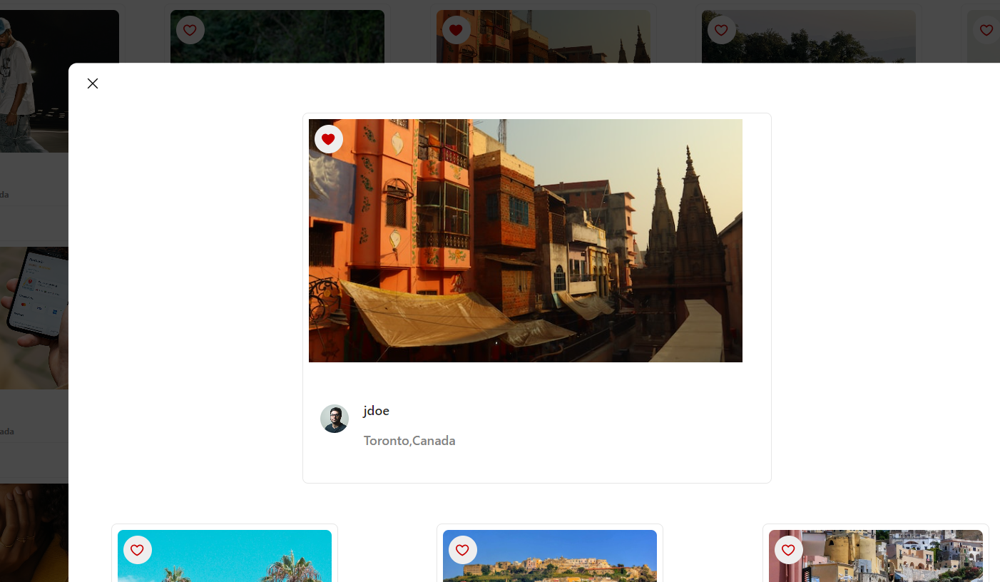
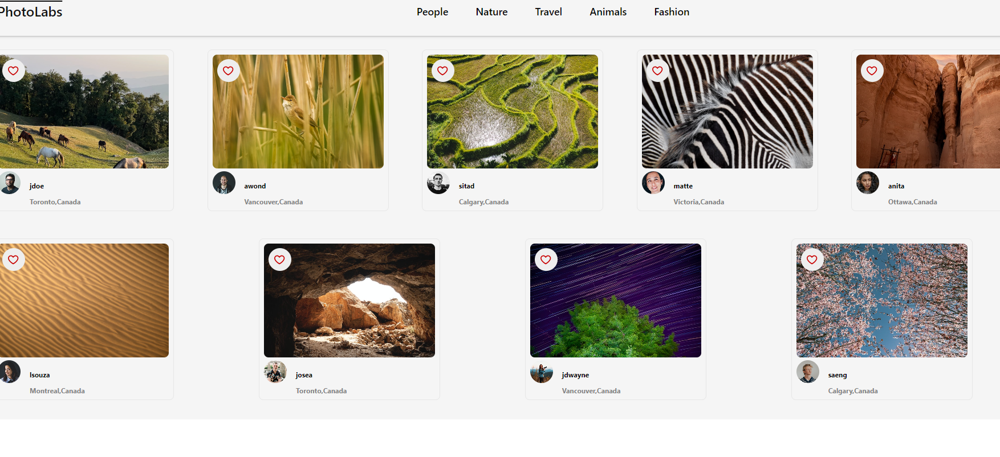

# PhotoLab Project
A social newWork React based, where you can see photos, like your favorit photos and look at similer photos.

# screenShots

## Getting Started
1. http://localhost:3000 run the url in your browser
2. main page have a top vanigation bar with diffrent topics and heart.
3. Body page with diffrent photos of users 
4. User can liked their Ravorits Photos and see the notifiation.
5. User can open photo and see similr photo.
6. User can chose photo topic and see all the photos of the same topic.

## Dependencies

-axios
-react
-sass
-proxy